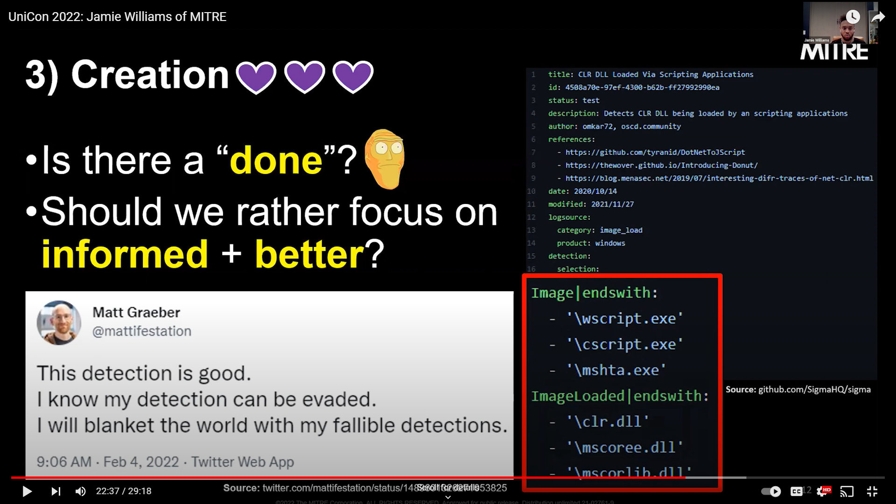
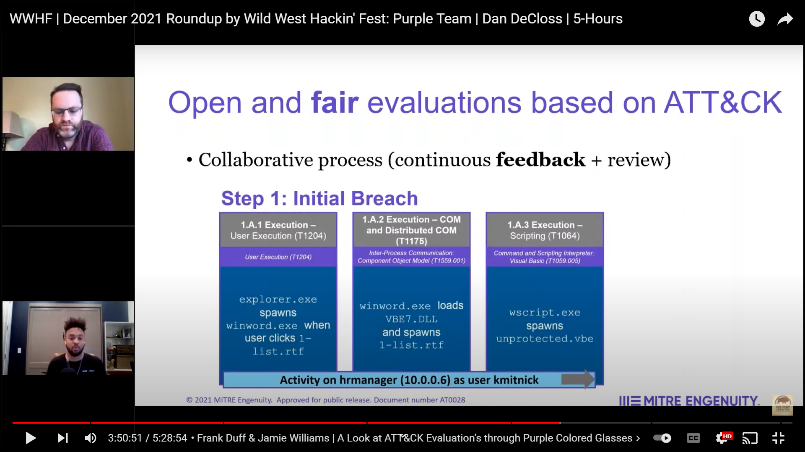

# Upcoming

## Purple Hats 2023
### You Want Us to Emulate What!?! [(Agenda)](https://www.purplehats.org/2023/agenda)

## RSAC Adversary Sandbox 2023
### Dressing Adversary Emulation in Business Attire: Outcomes and Successes [(Agenda)](https://www.rsaconference.com/USA/agenda/session/Dressing%20Adversary%20Emulation%20in%20Business%20Attire%20Outcomes%20and%20Successes)

# Past

## Atomics on a Friday 
### APT29 Emulation Plan Part 1 [(Video)](https://www.youtube.com/live/Qq-5hkOvfMQ?feature=share) and Part 2 [(Video)](https://youtu.be/FzfXyq6eL4k) w/ @burning_pm & @M_haggis

## Detection: Challenging Paradigms (DCP) Podcast
### Episodes 24 [(Video)](https://youtu.be/LACAHuVxWwk) and Episode 26 [(Video)](https://youtu.be/L6OZCR6KlPQ) w/ @jaredcatkinson, @jsecurity101, & @v3r5ace

## UNICON 2022
### Should Your Red Team Really Care About Detection Data Sources? What ATT&CK Can Show Us…[(Video)](https://youtu.be/qLmWnrJMg6o)

## MITRE Engenuity Threat-Informed Defense User Conference
### The Purple Elephant in the Room w/ Michael Long & Steve Luke [(Video)](https://youtu.be/Jxa5F2UyrrA)

## MITRE Engenuity Threat-Informed Defense User Conference
### Sharing is Caring and Awkward Conversations That Bring Us Together w/ @FrankDuff [(Video)](https://youtu.be/a6EQgC33D7s)

## Roundup by Wild West Hackin' Fest: Purple Team 
### A Look at ATT&CK Evaluations Through Purple Colored Glasses w/ @FrankDuff [(Video)](https://youtu.be/wqPBY71tr9Y?t=3h30m27s)

## DEF CON 29 Adversary Village
### Panel discussion: Is Adversary Emulation Too ___ For You? w/ @FrankDuff, Michael Long, @teschulz, @coolestcatiknow, & Jose Barajas [(Video)](https://youtu.be/HUmjhf-vSG0)

## SANS Purple Team Summit 2021
### Which Came First: The Phish or the Opportunity to Defend Against It w/ @thecookiewanter [(Video)](https://youtu.be/bflFC3b4WUg)

## SANS CloudSecNext Summit 2021
### Which way is the SolarWind Blowing? Techniques are changing…are you ready? w/ @stromcoffee [(Video)](https://youtu.be/7tf-dlV1vXM)

## SANS Blueprint Podcast
### Episode 20: Adversary Emulation w/ @SecHubb [(Audio)](https://www.sans.org/blueprint-podcast/adversary-emulation-with-jamie-williams)

## MITRE ATT&CKcon Power Hour 2020
### Putting the PRE into ATT&CK w/ @thecookiewanter [(Video)](https://youtu.be/M_uG_hlmTcA)

## SANS Threat Hunting & IR Summit 2020
### Started from the Bottom: Exploiting Data Sources to Uncover ATT&CK Behaviors w/ @Cyb3rPanda [(Video)](https://youtu.be/eKeydMrXsOE)

## GRIMMCon 0x2
### Reaping What They Sow - Hard Lessons Learned Emulating Threat Actors [(Video)](https://youtu.be/6bER6cfkj_s)

## Virtual SOURCE Boston 2020
### Getting Bear-y Cozy with PowerShell: Defensive Lessons Learned from Emulating the Dukes w/ @thecookiewanter [(Slides)](https://www.slideshare.net/JamieWilliams130/getting-beary-cozy-with-powershell)

## BSidesLV 2019
### ATT&CKing Your Adversaries -- Operationalizing cyber intelligence in your own environment for better sleep and a safer tomorrow w/ @sarah__yoder [(Video)](https://youtu.be/JPcjEneAvB0)

## x33fcon 2019
### APT ATT&CK - Threat-based Purple Teaming (Continued) w/ @d4weiss [(Video)](https://youtu.be/UDCRyilt4I0)

## SANS Blue Team Summit 2019 
### To Blue with ATT&CK-Flavored Love [(Video)](https://youtu.be/9X-LO7aGr2s)

## BSides DC 2018
### One technique, two techniques, red technique, blue technique w/ @d4weiss [(Video)](https://youtu.be/9poBbxLSGlQ)

