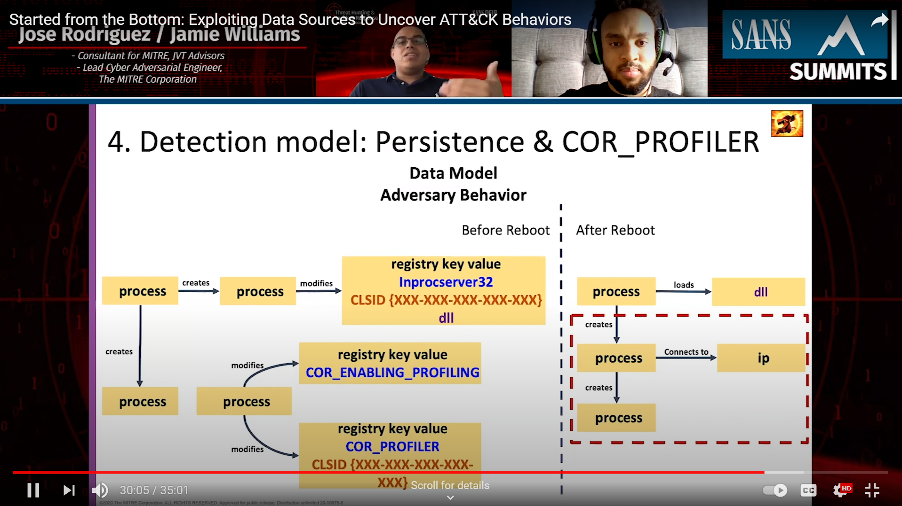

# con_things

### Upcoming

#### SANS Threat Hunting & IR Summit 2020: Started from the Bottom: Exploiting Data Sources to Uncover ATT&CK Behaviors w/ @Cyb3rPanda [(Agenda)](http://www.sans.org/u/16PP)

***

### Past

#### GRIMMCon 0x2: Reaping What They Sow - Hard Lessons Learned Emulating Threat Actors [(Video)](https://youtu.be/6bER6cfkj_s)

#### Virtual SOURCE Boston 2020: Getting Bear-y Cozy with PowerShell: Defensive Lessons Learned from Emulating the Dukes [(Slides)](https://www.slideshare.net/JamieWilliams130/getting-beary-cozy-with-powershell)

#### BSidesLV 2019: ATT&CKing Your Adversaries - Operationalizing cyber intelligence in your own environment for better sleep and a safer tomorrow [(Video)](https://youtu.be/JPcjEneAvB0)

#### x33fcon 2019: APT ATT&CK - Threat-based Purple Teaming (Continued) [(Video)](https://youtu.be/UDCRyilt4I0)

#### SANS Blue Team Summit 2019: To Blue with ATT&CK-Flavored Love [(Video)](https://youtu.be/9X-LO7aGr2s)

#### BSides DC 2018: One technique, two techniques, red technique, blue technique [(Video)](https://youtu.be/9poBbxLSGlQ)

